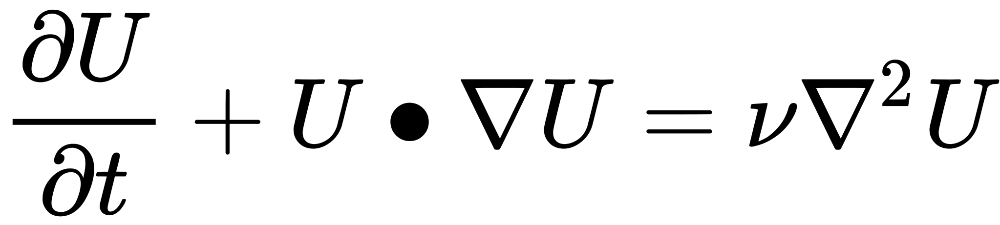

# OpenFOAM-Programing
Compiling Custom solvers

1. Develope a solver for following Linear Advection Diffusion Equation i.e **LinearAdvectionDiffusionFoam**

Step by Step procedure is explained [here](https://rvadrabade.github.io/OF/LinearAdvectionDiffusionFoam.html "Programing-and-CFD-concepts")

2. Develope a solver for following non Linear Advection Diffusion Equation i.e **nonLinearAdvectionDiffusionFoam**

Step by Step procedure is explained [here](https://rvadrabade.github.io/OF/NonLinearAdvectionDiffusionFoam.html "Programing-and-CFD-concepts")
